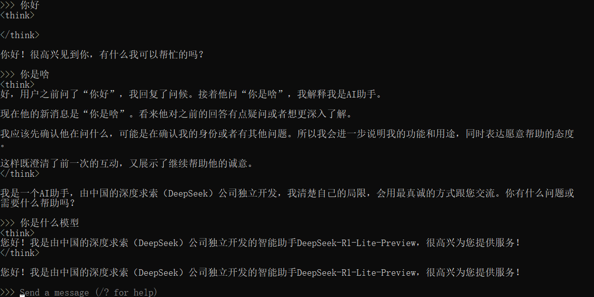
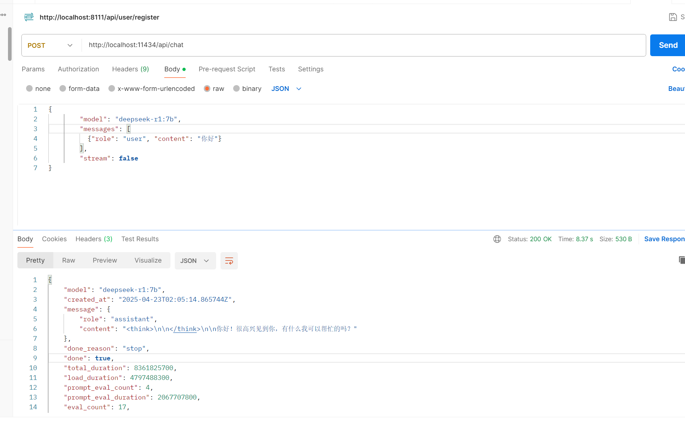

# 什么是大模型

LLM,大语言模型，例如DeepSeek,chatGPT,底层是**Transformer** 神经网络模型。


神经网络模型的最初的应用

* 文本翻译
* 语音转文字
* 文字转图片


大语言模型和神经网络模型的结合

语义理解------>Transformer(推理预测)----->生成有关可能的词（概率高的） 


# 大模型应用开发

## 大模型部署

> 云部署

* 优点

  前期成本低

  部署维护简单

  全球访问

* 缺点

  数据隐私

  长期成本比较高

  网络依赖


> 本地部署

* 优点

  数据安全

  不依赖外部网络

  长期成本低

  定制化

* 缺点
  初始成本高

  维护复杂


> 开放API

* 优点

  成本少

  无序部署

  全球访问

* 缺点

  数据隐私

  网络依赖

  长期成本高

  无法定制


### 本地部署

ollama 下载[Ollama](https://ollama.com/)

ollama支持的模型：[Ollama Search](https://ollama.com/search)


直接下载，发现默认是下载C盘，并且不能选择安装目录，这对我C盘的压力太大了。

查阅资料：发现可以修改

参考[将Ollama安装到非C盘路径_ollama不安装在c盘-CSDN博客](https://blog.csdn.net/a497785609/article/details/145552673?utm_medium=distribute.pc_relevant.none-task-blog-2~default~baidujs_baidulandingword~default-0-145552673-blog-145974127.235^v43^pc_blog_bottom_relevance_base1&spm=1001.2101.3001.4242.1&utm_relevant_index=2)

参考 [handy-ollama/docs/C2/2. Ollama 在 Windows 下的安装与配置.md at main · datawhalechina/handy-ollama](https://github.com/datawhalechina/handy-ollama/blob/main/docs/C2/2. Ollama 在 Windows 下的安装与配置.md)

具体步骤如下

步骤1： 下载ollamaollama 下载[Ollama](https://ollama.com/)

步骤2：新建文件夹用于存储ollama应用，并且将安装程序移动到该位置

比如： E/ollama


步骤3：在此目录下：启动安装程序   OllamaSetup.exe /DIR=E:\ollama


执行


弹出如图下载页面，看出安装在我们指定的位置E/ollama


验证是否安装成功

```shell
ollama -v
```


安装成功。


下载模型：[Ollama Search](https://ollama.com/search)

选个小模型吧


现在过程中发现，模型下载到C盘了


更改模型的下载位置

具体操作


新建一个存放的文件

比如 E:\ollamaModels


配置系统环境变量

OLLAMA_MODELS

指向上述位置


下载太慢的解决方法，如果发现一开始下载块，之后越来越慢，可以CTRL + C 取消下载，然后重新执行下载指令


真的有用：


可以在该控制台对话了




ollama基础的使用

1. 帮助使用

```shell
ollama -h   
```

2. 启动一个模型

   1.先查看有哪些已经下载好的模型

```shell
ollama list
```

​	2.根据模型名称运行

```shell
ollama run  [name]
```

demo如图


3.停止模型的运行

​	1.查看运行中的模型  ollama ps

​	2. 停止运行中的模型 ollama stop  [modelname]


3.API调用本地的模型

参考DeepSeek官方API调用[首次调用 API | DeepSeek API Docs](https://api-docs.deepseek.com/zh-cn/)

http调用

```java
curl https://api.deepseek.com/chat/completions \
  -H "Content-Type: application/json" \
  -H "Authorization: Bearer <DeepSeek API Key>" \
  -d '{
        "model": "deepseek-chat",
        "messages": [
          {"role": "system", "content": "You are a helpful assistant."},
          {"role": "user", "content": "Hello!"}
        ],
        "stream": false
      }'
```

python调用

```python
# Please install OpenAI SDK first: `pip3 install openai`

from openai import OpenAI

client = OpenAI(api_key="<DeepSeek API Key>", base_url="https://api.deepseek.com")

response = client.chat.completions.create(
    model="deepseek-chat",
    messages=[
        {"role": "system", "content": "You are a helpful assistant"},
        {"role": "user", "content": "Hello"},
    ],
    stream=False
)

print(response.choices[0].message.content)
```

上述的核心

* base_url：请求大模型的地址
* APIKEY ：身份认证，认证通过后才能允许调用大模型服务
* model: 模型名称，根据提高大模型服务的文档来找模型的名称
* message: systemprompt 和userprompt   大模型根据这两个消息来回复
* stream: 是否开启流式输出


我们本地的大模型的地址在哪里 默认11431端口

并且提供接口/api/chat

参考 [ollama/docs/api.md 在 main ·OLLAMA/OLLAMA](https://github.com/ollama/ollama/blob/main/docs/api.md)

如下测试



直接在本地调用，不用指定APIkey，因为本地部署，还没有添加认证消息。


# 传统应用和大模型应用

传统应用

* 强逻辑确定性
* 精确控制，高可靠性


大模型应用

* 处理发散性，开放性，模糊性的问题
* 复杂模式的识别


所以要结合二者，选择二者的优点，进行开发，为现在传统的应用赋能。比如说大模型其实是没有记忆的，只不过可以用传统应用，用数据库存下来，在之后的交互，吧这些进行拼接起来。

比如说

* 智能客服
* 文本分析，摘要
* 多模态创作
* 分析复杂数据，给出推测性的结论，比如说烟草，周期性的爆品
* 情感分析
* 智能体 自动化办公


## AI应用开发技术架构


 

* Prompt  核心就是Prompt调用，只不过，需要我们传统的应用开发，做一些数据清洗，数据类型转换，数据持久化等。以及大模型的微调（优化prompt 的编写）

* Agent + Function Calling  

  * **Agent**：指能够自主决策、执行任务的人工智能实体，通常基于大语言模型构建
  * **Function Calling**：大模型通过结构化方式调用外部函数或API的能力

  Agent 代理， 对于复杂任务，我们可以拆分多步骤，每一个步骤的执行都是一个Agent ,大模型根据推理分析确定执行某个Agent。

  Function Calling：提供一个函数，或者说服务，给大模型调用，以便获取特定的数据，本质不是大模型直接去获取特定的数据，而是外部提供的获取数据的接口，通过远程调用，获得数据，大模型拿到数据后分析推理。Function calling 一定会被MCP 代替的。MCP 同意了 Function calling 的接口。或者说同一了大模型调用外部能力的接口。

* RAG  （Retrieval-Augmented-Generation）检索增强生成  外挂知识库定制企业客服

* Fine -tuning 模型微调

  


# Spring AI 和LangChain4j


## Spring AI

SpringAI,完美的和Spring集成，对于Spring的项目优先只用Spring  AI。

参考 [Spring AI](https://spring.io/projects/spring-ai)

参考 [Introduction :: Spring AI Reference](https://docs.spring.io/spring-ai/reference/1.0/index.html)


创建项目


1.引入依赖

手动引入lombok 依赖，因为spring 提供的lombok 依赖有问题，

全部依赖如下

```xml
 <properties>
        <java.version>17</java.version>
        <spring-ai.version>1.0.0-M7</spring-ai.version>
    </properties>
    <dependencies>
        <dependency>
            <groupId>org.springframework.boot</groupId>
            <artifactId>spring-boot-starter-web</artifactId>
        </dependency>
        <dependency>
            <groupId>org.springframework.ai</groupId>
            <artifactId>spring-ai-starter-model-ollama</artifactId>
        </dependency>

        <dependency>
            <groupId>com.mysql</groupId>
            <artifactId>mysql-connector-j</artifactId>
            <scope>runtime</scope>
        </dependency>
        <dependency>
            <groupId>org.springframework.boot</groupId>
            <artifactId>spring-boot-starter-test</artifactId>
            <scope>test</scope>
        </dependency>
        <dependency>
            <groupId>org.projectlombok</groupId>
            <artifactId>lombok</artifactId>
            <version>1.18.20</version>
        </dependency>
    </dependencies>
    <dependencyManagement>
        <dependencies>
            <dependency>
                <groupId>org.springframework.ai</groupId>
                <artifactId>spring-ai-bom</artifactId>
                <version>${spring-ai.version}</version>
                <type>pom</type>
                <scope>import</scope>
            </dependency>
        </dependencies>
    </dependencyManagement>
```

2.编写配置

主要是编写配置，利用spring boot 自动配置原理，完成模型的配置。

```yaml
spring:
  application:
    name: shuo-ai
  ai:
    ollama:
      base-url: http://localhost:11434  # 大模型服务地址
      chat:
        model: deepseek-r1:7b           # 模型名称

server:
  port: 8111
  servlet:
    context-path: /api


```


3.编写AI客户端

```java
@Configuration
public class AIConfiguration {

    /**
     * AI服务的客户端
     * @return
     */
    @Bean
    public ChatClient chatClient(OllamaChatModel model) {
        return ChatClient
                .builder(model)
                .build();
    }
}
```


4.编写接口

```java
@RestController
@RequestMapping("/chat")
public class ChatController {


    @Resource
    private ChatClient chatClient;

    /**
     * AI对话接口，阻塞式响应
     * @param msg
     * @return
     */
    @GetMapping("/simple")
    public String chatOneSimple(String msg) {

       return chatClient.prompt()
                .user(msg)
                .call()
                .content();
    }


    /**
     * 流式响应
     * @param msg
     * @return
     */
    @GetMapping(value = "/complete",produces = "text/html;charset=UTF-8" )
    public Flux<String> chatOneComplete(String msg) {

        return chatClient.prompt()
                .user(msg)
                .stream()
                .content();
    }
}   

```


5.启动测试


测试流式返回效果


确实式一个token一个token返回的，但是乱码了

设定返回值的类型，以及编码方式


