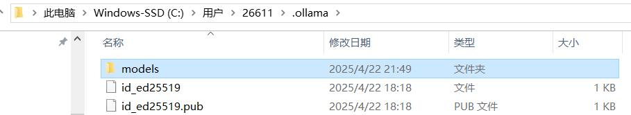

# 什么是大模型

LLM,大语言模型，例如DeepSeek,chatGPT,底层是**Transformer** 神经网络模型。


神经网络模型的最初的应用

* 文本翻译
* 语音转文字
* 文字转图片


大语言模型和神经网络模型的结合

语义理解------>Transformer(推理预测)----->生成有关可能的词（概率高的） 


# 大模型应用开发

## 大模型部署

> 云部署

* 优点

  前期成本低

  部署维护简单

  全球访问

* 缺点

  数据隐私

  长期成本比较高

  网络依赖


> 本地部署

* 优点

  数据安全

  不依赖外部网络

  长期成本低

  定制化

* 缺点
  初始成本高

  维护复杂


> 开放API

* 优点

  成本少

  无序部署

  全球访问

* 缺点

  数据隐私

  网络依赖

  长期成本高

  无法定制


### 本地部署

ollama 下载[Ollama](https://ollama.com/)

ollama支持的模型：[Ollama Search](https://ollama.com/search)


直接下载，发现默认是下载C盘，并且不能选择安装目录，这对我C盘的压力太大了。

查阅资料：发现可以修改

参考[将Ollama安装到非C盘路径_ollama不安装在c盘-CSDN博客](https://blog.csdn.net/a497785609/article/details/145552673?utm_medium=distribute.pc_relevant.none-task-blog-2~default~baidujs_baidulandingword~default-0-145552673-blog-145974127.235^v43^pc_blog_bottom_relevance_base1&spm=1001.2101.3001.4242.1&utm_relevant_index=2)

参考 [handy-ollama/docs/C2/2. Ollama 在 Windows 下的安装与配置.md at main · datawhalechina/handy-ollama](https://github.com/datawhalechina/handy-ollama/blob/main/docs/C2/2. Ollama 在 Windows 下的安装与配置.md)

具体步骤如下

步骤1： 下载ollamaollama 下载[Ollama](https://ollama.com/)

步骤2：新建文件夹用于存储ollama应用，并且将安装程序移动到该位置

比如： E/ollama


步骤3：在此目录下：启动安装程序   OllamaSetup.exe /DIR=E:\ollama


执行


弹出如图下载页面，看出安装在我们指定的位置E/ollama


验证是否安装成功

```shell
ollama -v
```


安装成功。


下载模型：[Ollama Search](https://ollama.com/search)

选个小模型吧


现在过程中发现，模型下载到C盘了




更改模型的下载位置

具体操作


新建一个存放的文件

比如 E:\ollamaModels


配置系统环境变量

OLLAMA_MODELS

指向上述位置


下载太慢的解决方法，如果发现一开始下载块，之后越来越慢，可以CTRL + C 取消下载，然后重新执行下载指令


真的有用：


可以在该控制台对话了


